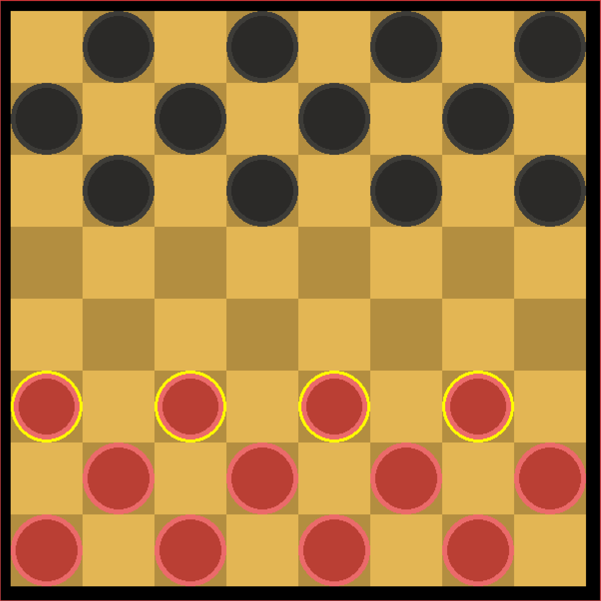
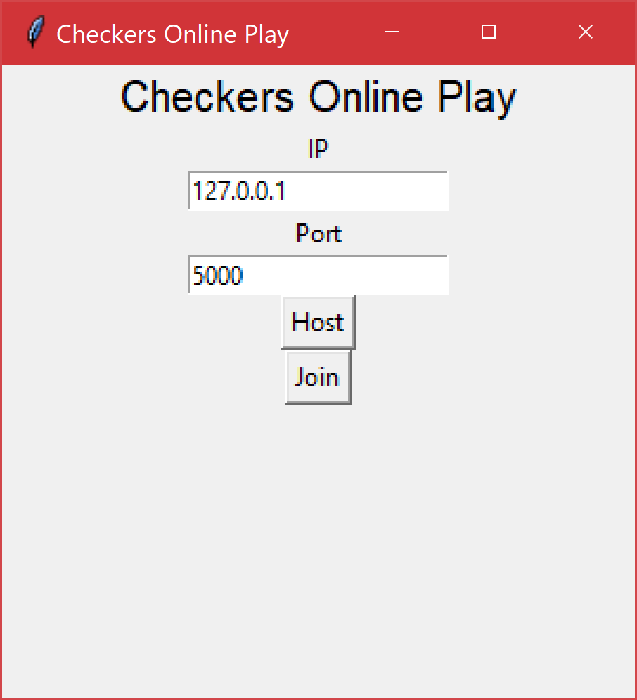
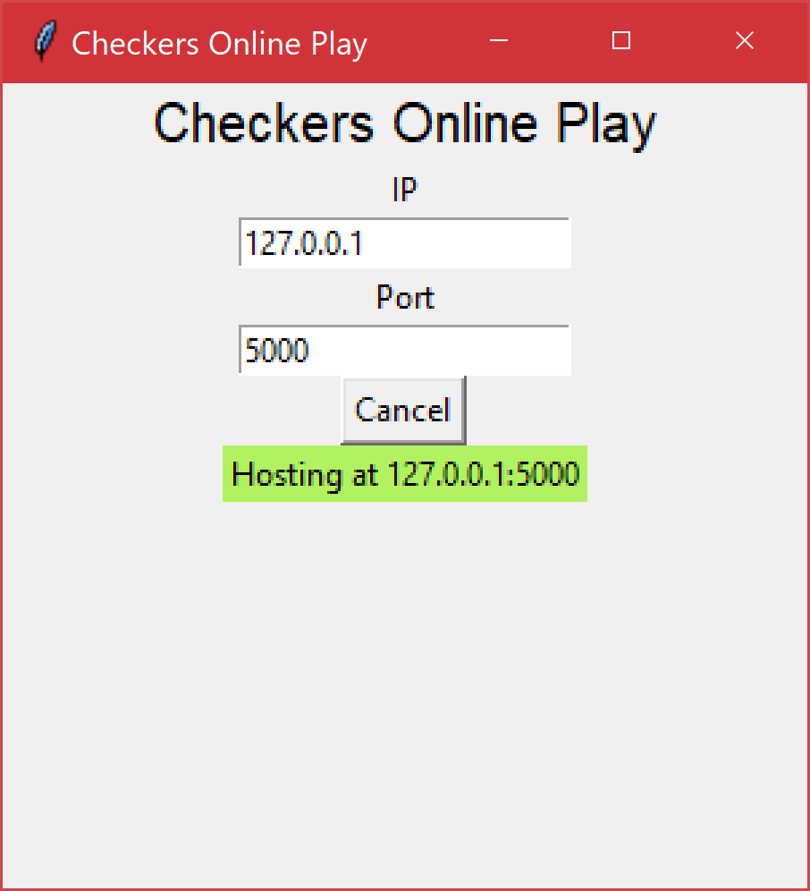
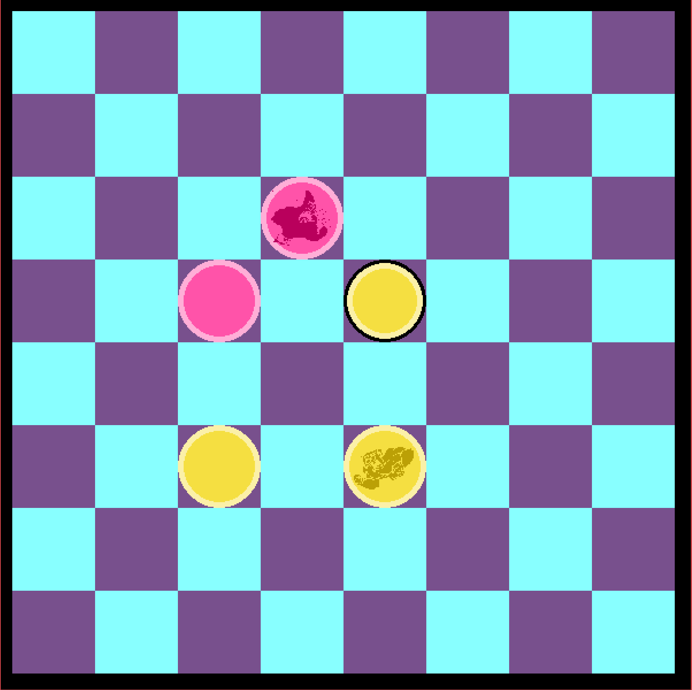
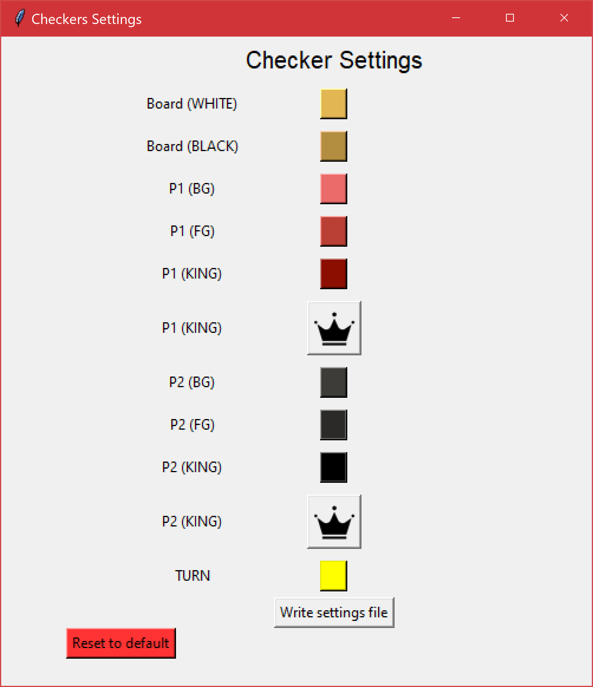
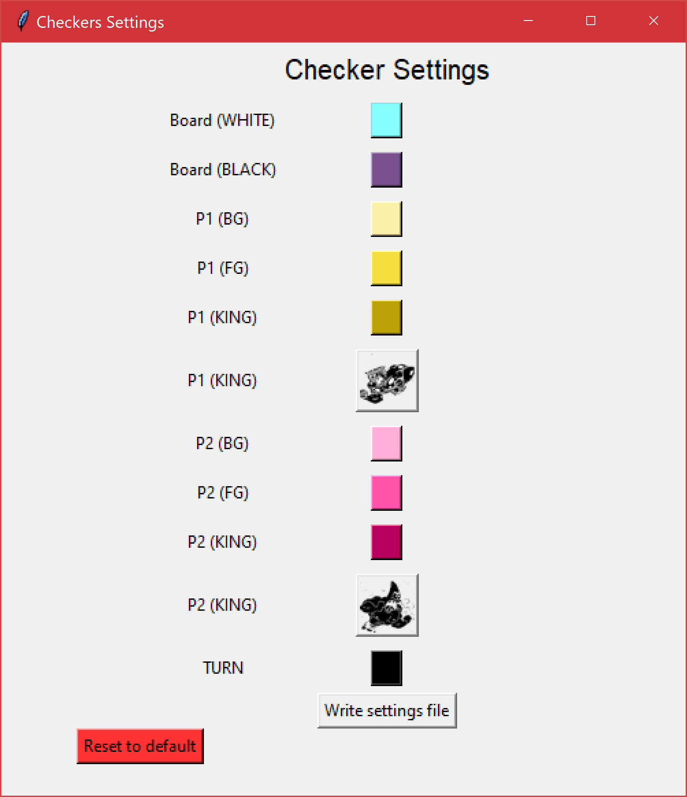

# Checkers

Just a simple implementation of the [checkers/draughts](https://en.wikipedia.org/wiki/Draughts) game made in [PyGame](https://www.pygame.org/) framework/engine.  



## Installing
This was built on **Windows** so it might not work on MacOS or Linux.

Python is required to run and play the game as of now. This was created using [Python 3.7.2](https://www.python.org/downloads/release/python-372/) 

Requirements are **PyGame** and **Pillow** which can be installed using the command

**On Windows:**  `pip install pygame pillow`

<!--**On Unix/Mac:**  

` pip3 install pygame pillow `-->

## Playing locally 

To play locally, all you need to do is launch the game using the command 

**On Windows:** `python game.py`

<!--**On Unix/Mac:** 

` python3 game.py `-->

## Playing online 

### The GUI





You can host and join a game using the GUI using the command  

**On Windows:** `python online-gui.py`

### The Command Line

To play online, one player needs to host the game and the other player needs to connect to the game. 

By default games will be hosted at **IP** *localhost (127.0.0.1)* and **port** *5000*.  

***Hosting a game:***

**On Windows:** `python online.py host`

<!--**On Unix/Mac:**  

` python3 online.py host `-->

***Joining a game:***

**On Windows:** `python online.py join`

<!--**On Unix/Mac:**  

` python3 online.py join `-->

***Specifying the IP and port:***

When hosting or joining a game **`--ip IP`** and **`--port PORT`** can be used to specify the IP and port.

***` online.py ` as a whole***

```
usage: online.py [-h] [--ip IP] [--port PORT] {host,join}

Host or join a checkers game.

positional arguments:
  {host,join}   determines whether to host or join a game

optional arguments:
  -h, --help   show this help message and exit
  --ip IP      IP address to host/connect
  --port PORT  port to host/connect
```

## Customization 
  

You can change the settings of the **board colors**, the **piece colors** for players 1 and 2, the color that **highlights whose turn** it is, and even the **icon** for when a piece becomes a **king**. 

These can all be changed in the settings GUI by calling

**On Windows:** `python settings.py`




## TODO
- [ ] Add more gifs and images to README
- [ ] Finish host and client scripts to make the game playable online.
    - ~~Allow host to specify port.~~
    - ~~Allow client to specify IP and port.~~
    - ~~Make GUI for online play.~~
    - Randomize the players (host should not always be player 1) 
    - Double check for errors
    - Remove print statements for threads
- [ ] Customization
    - ~~Colors~~
    - Images (could be better)
- [ ] Check on Linux
- [ ] Reimplement resizing of the window
- [ ] Multiple modes
    - ~~Standard~~
    - Casual
    - International
- [ ] Reorganization
- [ ] Move limit so that game ends after a certain number of moves without capturing.
- [ ] Option to rotate the board when move is complete (not for online).
- [ ] Write comments. 
- [ ] Make program an executable.
